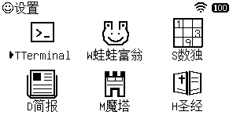
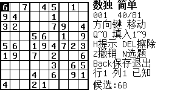
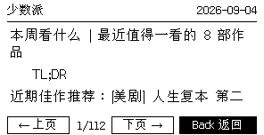
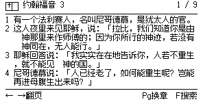

# C1 Slim Ports

一组为 C1 Slim / MP-D261 制作的应用移植与原生小程序。目标不是把设备变成高刷新率掌机，而是在 **296×152、纯黑白、无灰阶的墨水屏** 上提供适合键盘操作、低闪烁、可随时返回原厂桌面的实用程序。

## 当前布局

| 位置 | 快捷键 | 应用 | 实现 | 状态 |
| --- | --- | --- | --- | --- |
| 1 | `T` | Terminal | Go，VT100/PTY | 可用 |
| 2 | `W` | 蛙蛙富翁 | C1LavaX 运行时 | 可用；游戏资源不随仓库发布 |
| 3 | `S` | 数独 | 原生 C++ | 可用，内置 600 题 |
| 4 | `D` | 每日简报 | Go，联网 RSS/JSON | 可用 |
| 5 | `M` | 魔塔 | C1LavaX 运行时 | 可用；游戏资源不随仓库发布 |
| 6 | `H` | 圣经 | 原生 C++，离线 CUVS | 可用 |

## 共同设计

- 只输出黑/白两种像素，不使用灰度或抖动。
- 只有画面内容变化时才写入 `/dev/epaper_lcd`，没有动画或闪烁光标。
- 应用运行时临时启用快速刷新，并在退出时恢复原刷新参数。
- 启动时暂停原 `mpenMain`、保存其 5624 字节桌面帧；退出时写回帧并继续同一个进程，不显示“正在初始化”。
- 应用独占读取 `/dev/input/event0` 与 `/dev/input/event1`，退出前等待按键释放，避免按键穿透到桌面。
- 除 Terminal 外，Home 均被应用吞掉；Back/Esc 用于逐级返回或退出。

## 仓库结构

- [`C1Terminal`](C1Terminal/)：原生图形终端。
- [`C1LavaX/port`](C1LavaX/port/)：LavaX MIPS 运行时和蛙蛙富翁适配。
- [`C1Sudoku`](C1Sudoku/)：数独游戏与题库生成器。
- [`C1News`](C1News/)：每日简报、缓存和正文提取。
- [`C1Mota`](C1Mota/)：20 层魔塔集成脚本。
- [`C1Bible`](C1Bible/)：离线和合本阅读器与拼音全文搜索。
- [`docs`](docs/)：设备、构建、安装和第三方资料。
- [`launcher/terminal`](launcher/terminal/)：最初分析原厂 launcher 时保留的补丁工具，仅供研究和复现。

## 开始之前

请先阅读 [构建与安装](docs/BUILDING.md) 和 [设备与恢复说明](docs/DEVICE_NOTES.md)。这些补丁针对测试过的特定固件逐字节校验，**不要对其他固件强行跳过哈希检查**。

仓库不包含原厂 launcher、系统备份、设备日志、编译产物，也不包含蛙蛙富翁或魔塔的游戏本体。需要相关文件时，请从自己拥有的设备或合法副本中提取并放入被 `.gitignore` 排除的 `private/` 目录。

## 截图

| 数独 | 每日简报 | 圣经 |
| --- | --- | --- |
|  |  |  |

## 许可

本仓库原创代码默认采用 GPL-3.0；各第三方组件、字体、新闻源和文本数据仍遵循各自许可或使用条款，详见 [第三方资料](docs/THIRD_PARTY.md)。这不是官方固件，使用者应自行备份并承担刷写风险。
